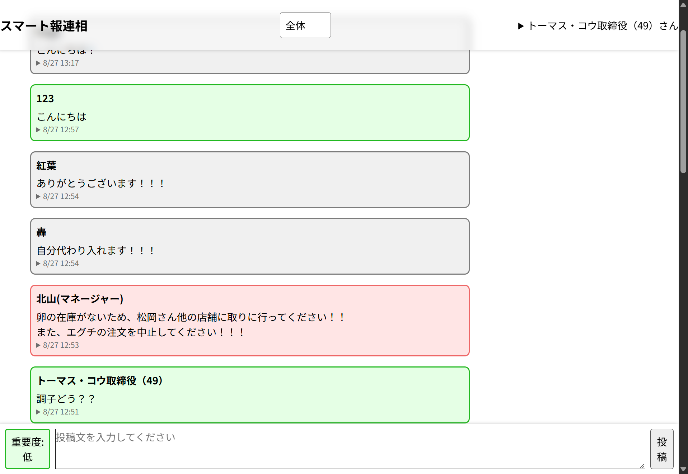

# スマート報連相チャット

株式会社ラクスの東京第2オフィスで、8/25~27の3日間ハッカソン型インターンシップ「RAKUS Tech Lab」が開催されました。

私はチームBに配属され、メンバー4人と共同開発しました。

同社の「顧客志向」を大切にしながら、飲食チェーン店で使われるLINEグループに代わる連絡手段として、「ジャンル・重要度分け」機能に特化したチャットアプリを作成しました。



## 開始

下記コマンドでサーバーが開始します

```
docker compose -f 'compose.yaml' up -d --build
```

アプリを開くには[http://localhost:3000/](http://localhost:3000/)にアクセスします

## 管理

コンソールに入るには

```
docker compose run --build --rm app bash
```

サーバーログを確認するには

```
docker exec -it ???-app-1 bash
```

'???'にはディレクトリ名を入れてください
